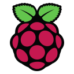

 
### Hi 👋

## 🛠🛠🛠🛠🛠
#### Language

Python / dotnet / JavaScript

 
 
 

<!--
#### IIoT ( smartfactory )

EdgeX / KubeEdge / Python

 
 
 
 

#### Infra

Docker / Kubernetes

 

#### FrontEnd

Vue / Electron

 
 

#### BackEnd

Django / Flask / FastAPI

 
 

#### Etc.

DB... / Naver Cloud Platform 

 
 

-->

<!--   -->
<!--
## types of project
  + data collection / device control
  + frontend
  + backend
  + virtualization
  + visualization
  + crawling / scrapying
  -->

## Portfolio in notion
📌 https://stormy-beat-1d9.notion.site/Portfolio-60b54da6d63e47d785b76100b1e9acba

<!--
**e7217/e7217** is a ✨ _special_ ✨ repository because its `README.md` (this file) appears on your GitHub profile.

Here are some ideas to get you started:

- 🔭 I’m currently working on ...
- 🌱 I’m currently learning ...
- 👯 I’m looking to collaborate on ...
- 🤔 I’m looking for help with ...
- 💬 Ask me about ...
- 📫 How to reach me: ...
- 😄 Pronouns: ...
- ⚡ Fun fact: ...
-->

